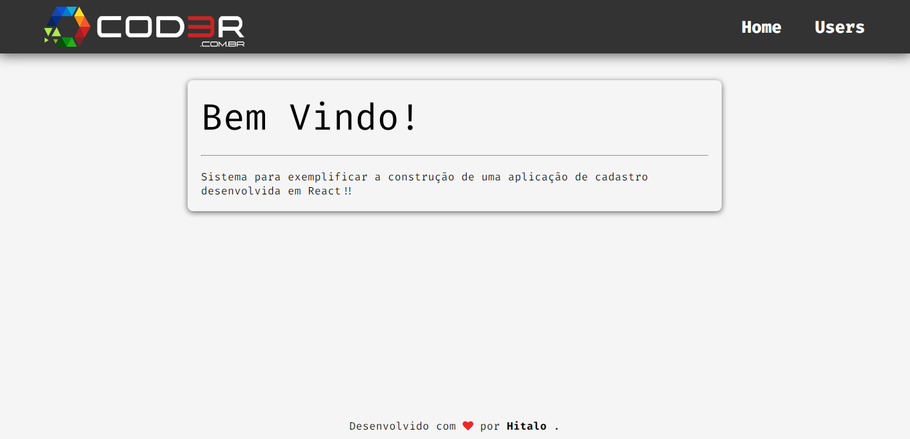
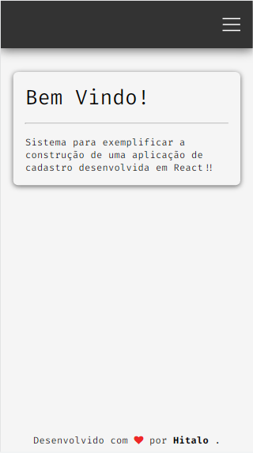
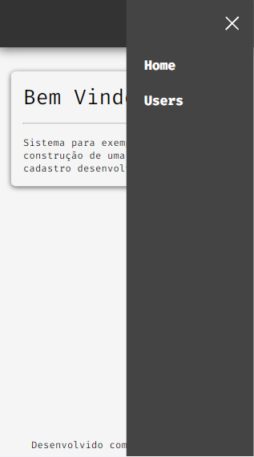

<h1 align="center">
  📰<br>Cadastro de usuário
</h1>

<h4 align="center">
  Projeto criado com o intuito de práticar conceitos e técnicas existentes dentro do ecossistema reactJS.
</h4>



### Mobile
<p align="center">
  
  
  
</p>

## 💼 Tecnologias utilizadas
Para o desenvolvimento deste projeto utilizei as seguintes tecnologias:

- HTML;
- CSS;
- Javascript;
- ReactJS;
- Hooks;
- React-Router-Dom;
- Json-server;

## Instalação e execução
Faça um clone desse repositório:
```git clone https://github.com/hitaloalvess/conceitos-reactjs.git```
    
- Executando o Back-end:
1.	Com o terminal aberto, execute o comando ```cd backend```;
2.	Execute ```npm install``` para realizar a instalação das dependencias;
3.	Execute ```npm start``` para realizar a inicialização da aplicação;
    
- Executando o Front-end:
1.	Com o terminal aberto, execute o comando ```cd frontend```;
2.	Execute ```npm install``` para realizar a instalação das dependencias;
3.	Execute ```npm start``` para realizar a inicialização da aplicação;


---
Made with ♥ by Hitalo 🚀
